### 1. How internet works?
>https://www.youtube.com/watch?v=x3c1ih2NJEg
### 2. What is API?
>Answer: 
>1.&nbsp;API stands for Application Programming Interface. 
>2.&nbsp;An API acts like a link that allows two application to talk to each other.  
>3.&nbsp;API is the part of server that receives requests and sends responses.  
>Example-1  
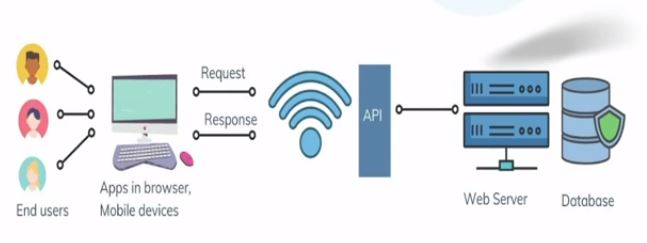  
>Example-2
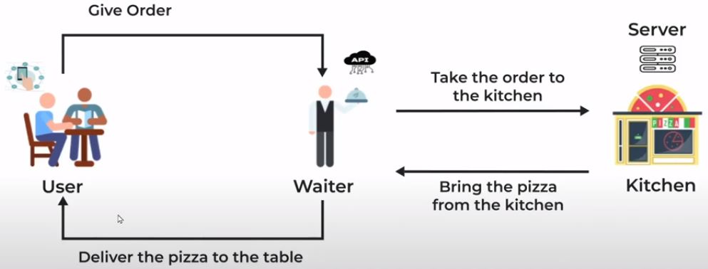  
>Example-3
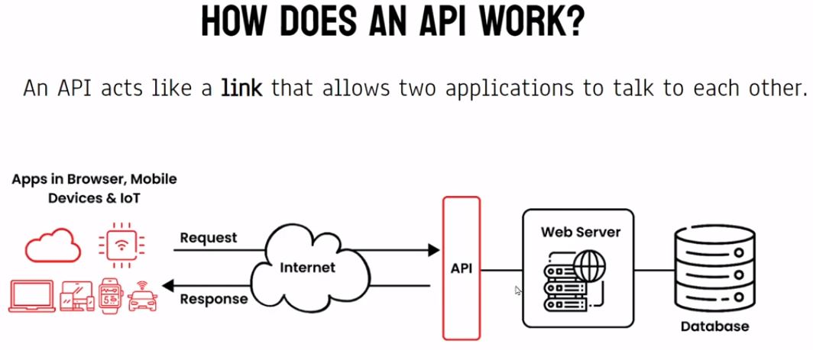  
### 3. What is JSON(Javascript Object Notation)?
> Answer :  
> JavaScript Object Notation is an open data interchange format that is both human and machine-readable.  
>JSON is a lightweight format for storing and transporting data. JSON is often used when data is sent from a server to a web page. JSON is "self-describing" and easy to understand.
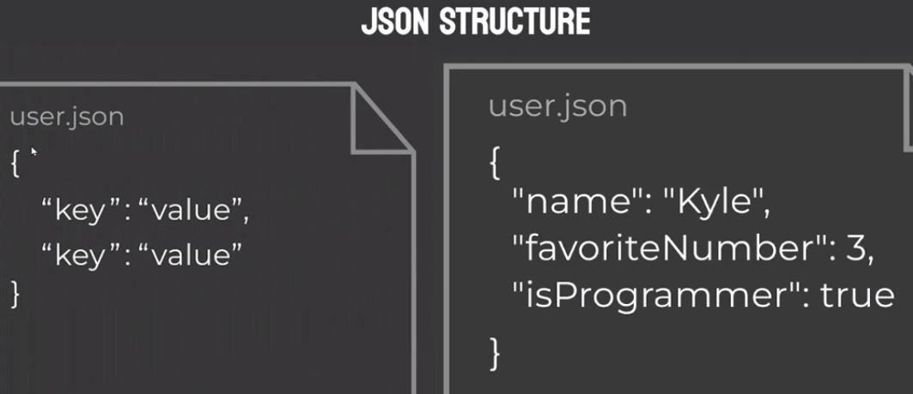  

### 3-1. What is the file extension of JSON?
>Answer:&nbsp;<b style='font-size:20px;'>.json</b>

### 3-2. What are the data types supported by JSON?
>JSON supports a value of type <b>String</b>, <b>Number</b> and <b>Boolean</b>. It does not support <b style="color:red;">octal</b> and <b style="color:red">hexdecimal</b> values.

### 4-1. What is the role of JSON.parse?
>The JSON. parse() method parses a JSON string, constructing the JavaScript value or object described by the string.  
>Parse the data with JSON. parse() , and the data becomes a JavaScript object.

### 4-2. JSON Parse
> 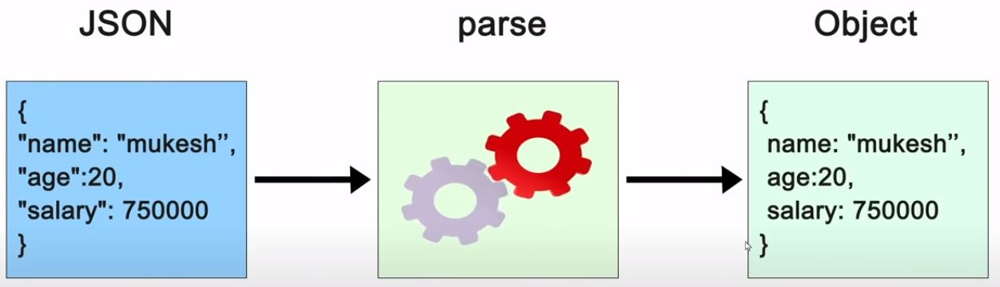  

### 5-1. What is the role of JSON.stringify?
>The JSON.stringify() method converts a JavaScript value to a JSON string.

### 5-2. JSON Stringify
> 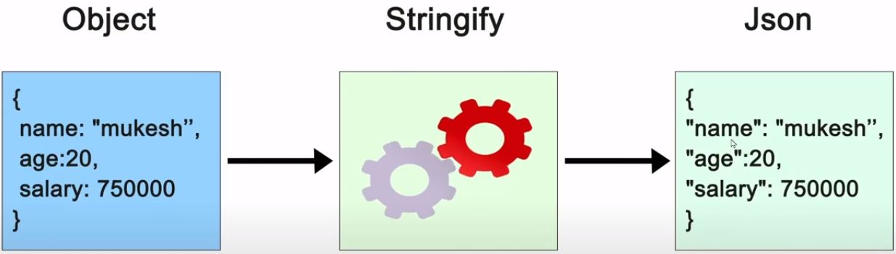   
### 6. What is FETCH API?
> Answer :  
> The Fetch API is a modern interface that allows you to make HTTP requests to servers from web browsers.
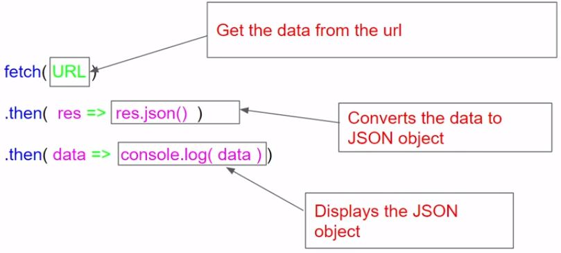
>Syntax<pre>fetch('https://APILink.xyz') .then(res => res.json()) .then(data => console.log(data))
</pre>

### 7-1. What are the HTTP methods supported by REST?
> 1.&nbsp;POST 2.&nbsp;GET 3.&nbsp;PUT 4.&nbsp;PATCH 5.&nbsp;DELETE

### 7-2. CRUD and REST API Methods :
>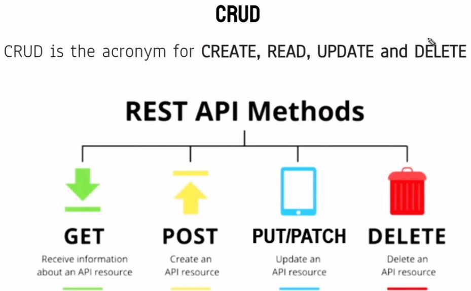

### 7-3. What are CRUD oparations?
>CRUD (Create, Read, Update, Delete) is an acronym for ways one can operate on stored data. It is a mnemonic for the four basic functions of persistent storage.

### 8. How GET method works?
>GET method is used to request data from a specified resource.
> 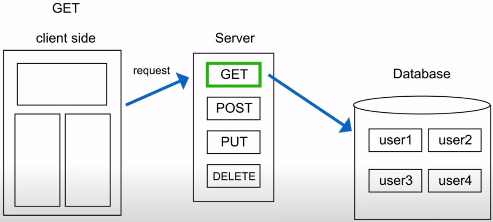
> 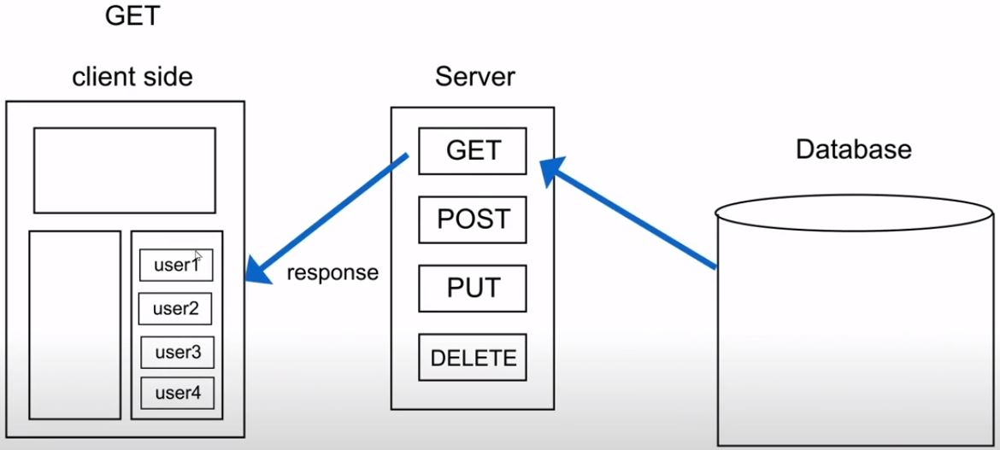

### 9. How POST method works?
>POST method is used to send data to a server to create a resource.
> 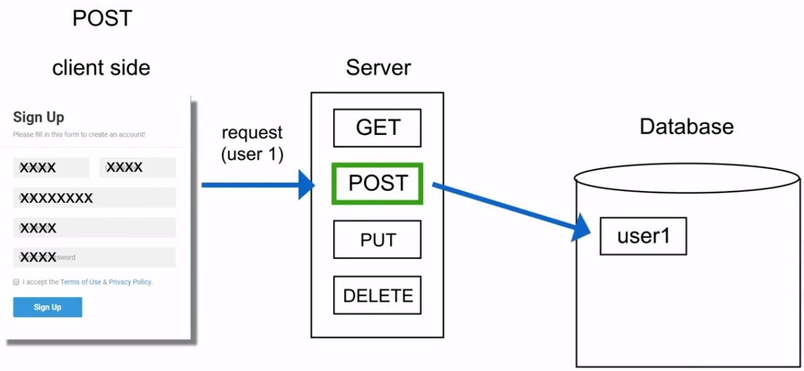
> 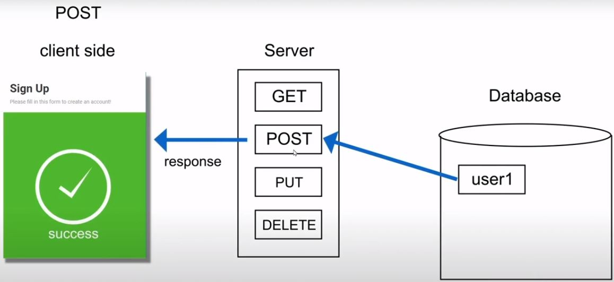

### 10. How DELETE method works?
>The DELETE method deletes the specified resource.
> 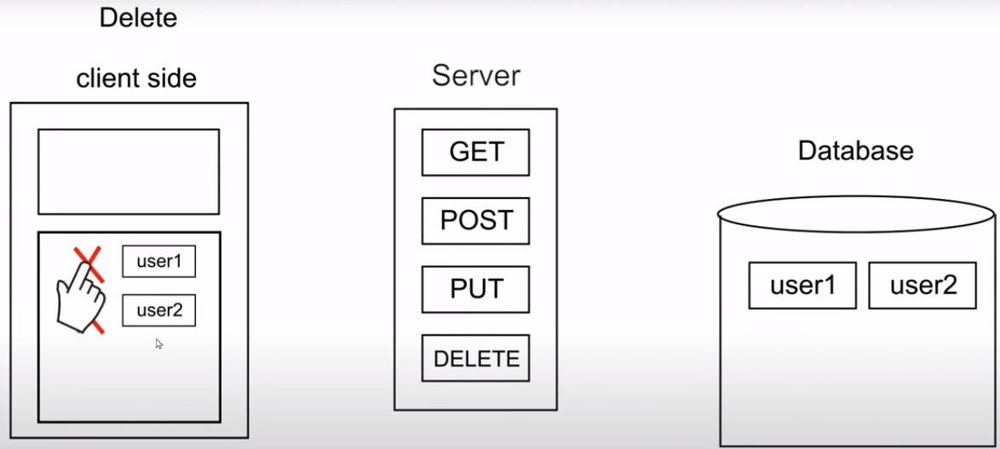
> 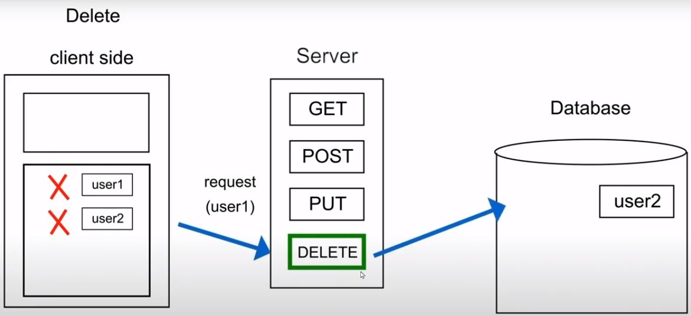
> 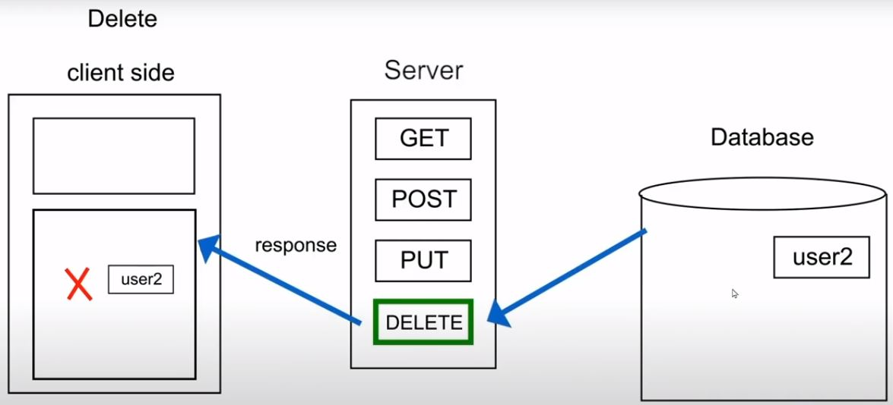

### 11. How PATCH method works?
>PATCH is used to send data to a server to update a resource.
>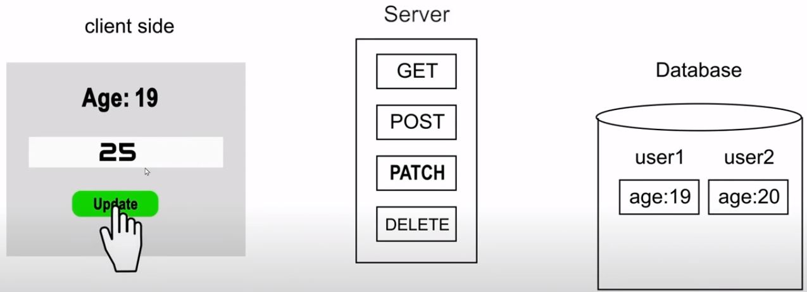
>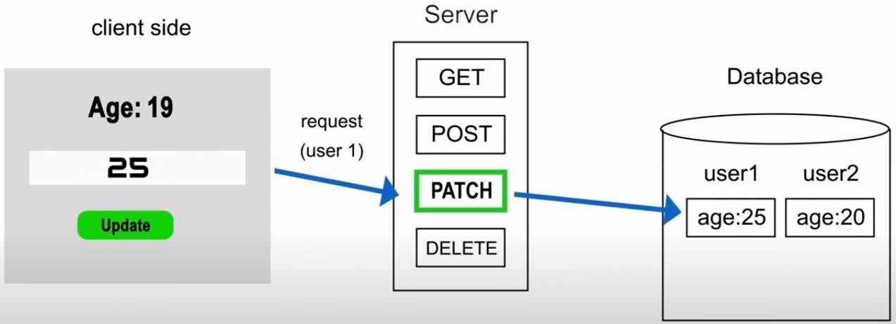
>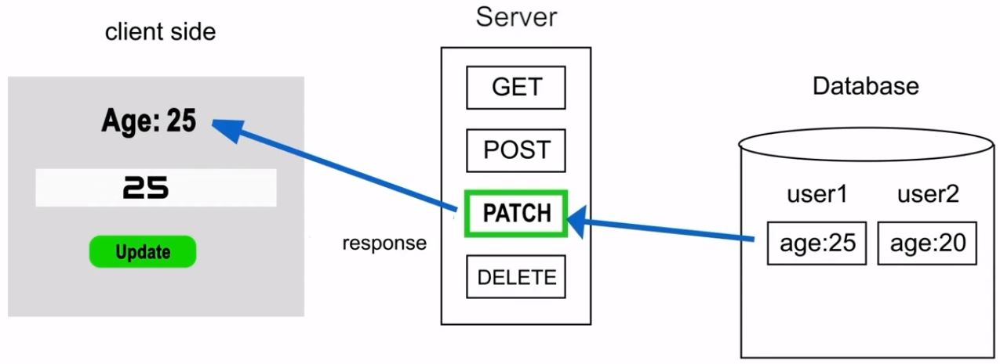

### 12. What is the defference between PUT, POST and PATCH?
>PUT vs POST vs PATCH !
>

### 13. HTTP Status Code :
>Link - https://developer.mozilla.org/en-US/docs/Web/HTTP/Status
>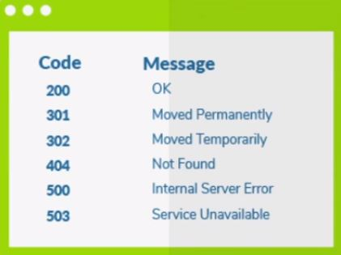
### 14. Can you use get request instead of put to create a resource?
>Answer : No, you are not supposed to use PUT for GET. GET operations should only have view rights, while PUT resource is used for updating a data.
### 15. GET এবং POST এর মধ্যে পার্থক্য ?
|S.No| GET request | POST request |
|-|-----------|------------|
|1|GET retrieves a representation of the specified resource.|POST is for writing data, to be processed to the identified resource.|
|2|It typically has relevant information in the URL of the request.|It typically has relevant information in the body of the request.|
|3|It is limited by the maximum length of the URL supported by the browser and web server.|It does not have such limits.|
|4|	It is the default HTTP method.|	In this, we need to specify the method as POST to send a request with the POST method.|
|5|	You can bookmark GET requests.|You cannot bookmark POST requests.|
|6|	It is less secure because data sent is part of the URL|It is a little safer because the parameters are not stored in browser history or in web server logs.|
|7|It is cacheable.|It is not cacheable.|
|8|	For eg. GET the page showing a particular question.|For eg. Send a POST request by clicking the “Add to cart” button.|