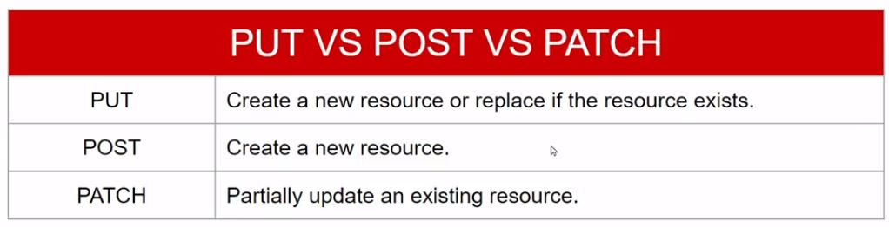

### 1. How internet works?
>https://www.youtube.com/watch?v=x3c1ih2NJEg
### 2. What is API?
>Answer: 
>1.&nbsp;API stands for Application Programming Interface. 
>2.&nbsp;An API acts like a link that allows two application to talk to each other.  
>3.&nbsp;API is the part of server that receives requests and sends responses.  
>Example-1  
  
>Example-2
  
>Example-3
  
### 3. What is JSON(Javascript Object Notation)?
> Answer :  
> JavaScript Object Notation is an open data interchange format that is both human and machine-readable.
  
### 4. JSON Parse
>   
### 5. JSON Stringify
>    
### 6. What is FETCH API?
> Answer :  
> The Fetch API is a modern interface that allows you to make HTTP requests to servers from web browsers.

>Syntax<pre>fetch('https://APILink.xyz') .then(res => res.json()) .then(data => console.log(data))
</pre>

### 7. CRUD and REST API Methods :
>

### 8. How GET method works?
>GET method is used to request data from a specified resource.
> 
> 

### 9. How POST method works?
>POST method is used to send data to a server to create a resource.
> 
> 

### 10. How DELETE method works?
>The DELETE method deletes the specified resource.
> 
> 
> 

### 11. How PATCH method works?
>PATCH is used to send data to a server to update a resource.
>
>
>

### 12. PUT vs POST vs PATCH !
>

### 13. HTTP Status Code :
>
### 7. GET এবং POST এর মধ্যে পার্থক্য ?